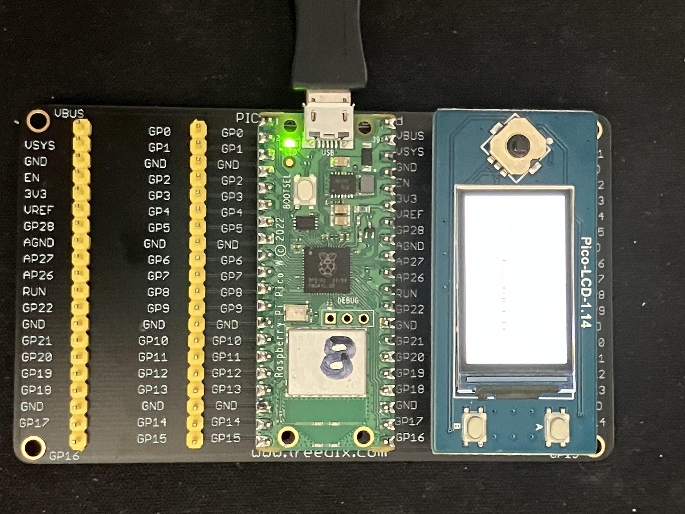

# Notes on learning to implement Bluetooth communication

* Early project used HC-05, 06 BT modules to enable communication between 2 Arduinos (Tele-op Omni-Car)

* My goal now is to implement BT to enable PS-4 gamepad to talk to Picobot

## Get some experience by following [Pico BT example](https://github.com/raspberrypi/pico-micropython-examples/tree/master/bluetooth), under [Pico MicroPython Examples](https://github.com/raspberrypi/pico-micropython-examples/tree/master).
* Followed the [Instructions](https://datasheets.raspberrypi.com/picow/connecting-to-the-internet-with-pico-w.pdf) at Chapter 6: Working with Bluetooth in MicroPython
    * Installed `ble_advertising.py` and `ble_temp_sensor.py` on Pico #5.
    * Started `ble_temp_sensor.py`.
    * Producing this output in thonny:
    ```
    Sensor name Pico 28:CD:C1:0B:30:D2
    write temp 28.45 degc
    write temp 28.45 degc
    write temp 27.51 degc
    write temp 27.98 degc
    write temp 27.98 degc
    write temp 27.98 degc
    ```
    * This BT device didn't show up at all in my phone.
    * It **did** show up on my laptop but failed to pair, after which it would no longer show up.
    * I could stop `ble_temp_sensor.py` and restart it and it would again show up on my laptop.
    * This is as far as I got...

## Got a pair of Pico W devices sending & receiving via Bluetooth
* Followed this tutorial [Getting to grips with Bluetooth on Pico W](https://www.raspberrypi.com/news/getting-to-grips-with-bluetooth-on-pico-w/?unapproved=1593844&moderation-hash=c09434601e7bbf96b52f26fa1744316c#comment-1593844) to get both the server and client devices working.
    * [server code](https://github.com/raspberrypi/pico-micropython-examples/blob/master/bluetooth/picow_ble_temp_sensor.py)
    * [client code](https://github.com/raspberrypi/pico-micropython-examples/blob/master/bluetooth/picow_ble_temp_reader.py)

## This project implements Kevin McAleer's tutorial on [Bluetooth Remote Controlled Robot](https://www.kevsrobots.com/blog/bluetooth-remote.html) which shows the use of `aioble` module to allow BT to work asynchronously.
* Kevin's tutorial shows using Bluetooth to connect a remote control (Pimoroni LCD screen wuth buttons) to his [Burgerbot](https://github.com/kevinmcaleer/burgerbot)
* The server on Kevin's project imports  `pimoroni.py` module which I chased down at the [Pimoroni website](https://shop.pimoroni.com/products/motor-shim-for-pico?variant=39878468894803)
* The client code needs `burgerbot.py` module which I found at [Kevin McAleer's Burgerbot repo](https://github.com/kevinmcaleer/burgerbot)
    * `burgerbot.py` needs `motor` and `servo`, which I wasn't able to find.
        * No matter... I'm not using burgerbot anyway.
* My project (below) uses a different LCD but aims to copy the Pico-to-Pico BLE communication exactly the same



### My Remote (bluetooth server)
* Instead of using the Pimoroni display, I am using the [Pico LCD 1.14](https://www.waveshare.com/wiki/Pico-LCD-1.14#Download_Demo_codes)
* Revised `remote.py` to `my_remote.py` to use the Pico LCD 1.14 device instead of the Pimoroni one.

### My Robot (bluetooth client)
* Revised `robot.py` to not import burgerbot

### Results
* Works great! Here is the output of the remote process:

```
>>> %Run -c $EDITOR_CONTENT
registering services
peripheral task started
blink task started
not connected
not connected
not connected
not connected
Connection from Device(ADDR_PUBLIC, 28:cd:c1:0a:4a:e2, CONNECTED)
connected: True
A
A
B
B
CTRL
CTRL
UP
UP
DOWN
DOWN
LEFT
LEFT
RIGHT
RIGHT
```

* But it crashes (after about a minute):
```
Traceback (most recent call last):
  File "<stdin>", line 239, in <module>
  File "uasyncio/core.py", line 1, in run
  File "uasyncio/core.py", line 1, in run_until_complete
  File "uasyncio/core.py", line 1, in run_until_complete
  File "<stdin>", line 237, in main
  File "uasyncio/funcs.py", line 1, in gather
  File "uasyncio/core.py", line 1, in run_until_complete
  File "<stdin>", line 215, in peripheral_task
  File "aioble/device.py", line 295, in __aexit__
  File "aioble/device.py", line 216, in disconnect
  File "aioble/device.py", line 232, in disconnected
  File "aioble/device.py", line 232, in disconnected
  File "uasyncio/core.py", line 1, in run_until_complete
  File "aioble/device.py", line 198, in device_task
  File "uasyncio/event.py", line 1, in wait
CancelledError: 
>>> 
```
* Meanwhile, this is the output of the robot process (on a subsequent run):
```
>>> %Run -c $EDITOR_CONTENT
blink task started
blink task stopped
starting peripheral task
Robot Remote not found
blink task started
blink task stopped
starting peripheral task
Found KevsRobots
UUID(0x1848)
Found Robot Remote Service
Connecting to Device(ADDR_PUBLIC, 28:cd:c1:0a:4c:25)
Connected
A button pressed
A button pressed
B button pressed
B button pressed
CNTR button pressed
CNTR button pressed
UP button pressed
UP button pressed
DOWN button pressed
DOWN button pressed
LEFT button pressed
LEFT button pressed
RIGHT button pressed
RIGHT button pressed
```

* Until the crash:
```
something went wrong; 
disconnected
blink task started
blink task stopped
starting peripheral task
Found KevsRobots
UUID(0x1848)
Found Robot Remote Service
Connecting to Device(ADDR_PUBLIC, 28:cd:c1:0a:4c:25)
Connected
```

### Efforts to resolve crashing issue
* Posted a comment on [Kevin's Youtube channel](https://www.youtube.com/watch?v=-0wCtKz1l78)
* I noticed that another person posted a comment (~ 1 month ago) reporting a `GatError` after ~ 1 minute.
* I uploaded the Pimoroni micropython version 1.20.4 (to replace the Paspberry Pi version) but this didn't solve the problem.
    * However it answered my question about where to find the missing modules (pimoroni, motor, servo). They are included in this version of micropython.
```
MicroPython 856e08b1931b88271816a2f60648f6ff332235b2, picow v1.20.4 on 2023-08-04; Raspberry Pi Pico W with RP2040
Type "help()" for more information.
>>> help("modules")
__main__          breakout_dotmatrix                  gc                pimoroni_bus
_boot             breakout_encoder  gfx_pack          pimoroni_i2c
_boot_fat         breakout_encoder_wheel              hashlib           plasma
_onewire          breakout_icp10125 heapq             pngdec
_rp2              breakout_ioexpander                 hub75             qrcode
_thread           breakout_ltr559   interstate75      random
_uasyncio         breakout_matrix11x7                 inventor          re
_webrepl          breakout_mics6814 io                rp2
adcfft            breakout_msa301   jpegdec           select
aioble/__init__   breakout_paa5100  json              servo
aioble/central    breakout_pmw3901  lwip              socket
aioble/client     breakout_potentiometer              machine           ssl
aioble/core       breakout_rgbmatrix5x5               math              struct
aioble/device     breakout_rtc      micropython       sys
aioble/l2cap      breakout_scd41    mip/__init__      time
aioble/peripheral breakout_sgp30    motor             uasyncio/__init__
aioble/security   breakout_trackball                  neopixel          uasyncio/core
aioble/server     breakout_vl53l5cx network           uasyncio/event
array             builtins          ntptime           uasyncio/funcs
automation        cmath             onewire           uasyncio/lock
binascii          collections       os                uasyncio/stream
bluetooth         cppmem            pcf85063a         uctypes
boot              cryptolib         picoexplorer      urequests
breakout_as7262   dht               picographics      version
breakout_bh1745   ds18x20           picokeypad        webrepl
breakout_bme280   encoder           picoscroll        webrepl_setup
breakout_bme68x   errno             picounicorn       websocket
breakout_bmp280   framebuf          pimoroni          zlib
Plus any modules on the filesystem
>>> 
```
